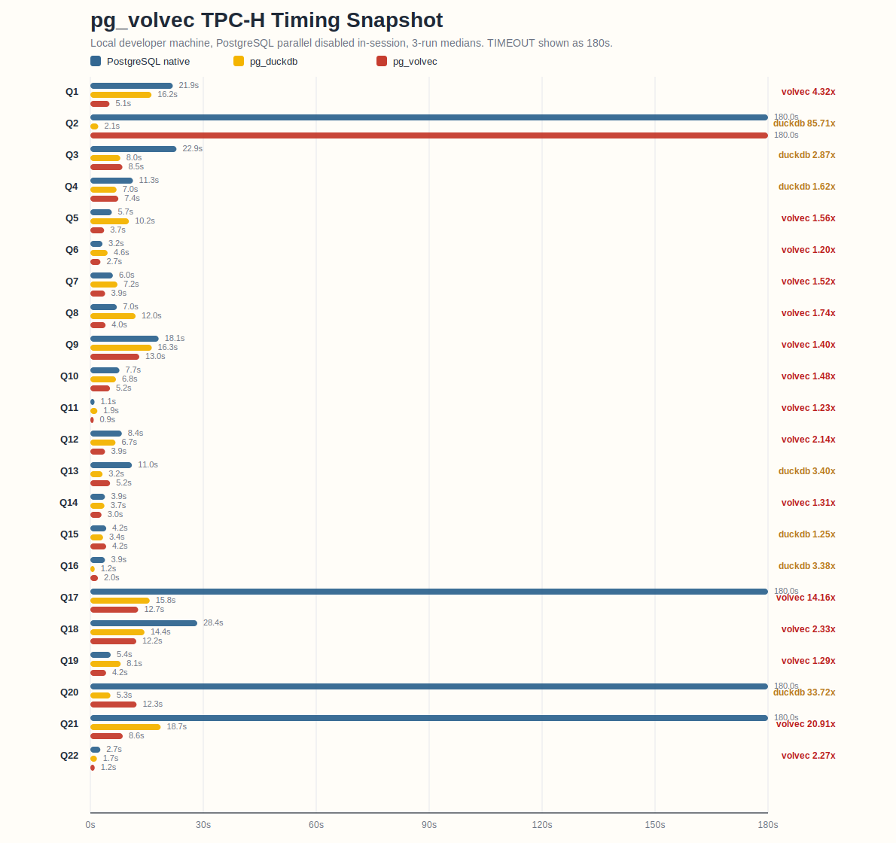

# pg_volvec

`pg_volvec` is a PostgreSQL extension prototype that keeps PostgreSQL planning unchanged and offloads supported OLAP plan subtrees into a vectorized executor. The name `pg_volvec` stems from the original intention to build a **volcano model** vectorized executor. However, future iterations may evolve the architecture into a **pipeline model** rather than sticking to the volcano model.

## Architecture

- PostgreSQL still plans the query. `pg_volvec` hooks `ExecutorStart` / `ExecutorRun` / `ExecutorEnd` and intercepts only supported subtrees.
- The execution engine is columnar and `DataChunk`-oriented. The main operator family today is `SeqScan -> optional qual -> HashJoin / Agg / Sort / Limit / SubqueryScan`.
- Scan hot paths use tuple deform JIT to decode heap tuples directly into typed column arrays.
- Expression evaluation lowers to a linear IR and, when supported, compiles to fused LLVM loops so intermediate vector temporaries do not need to be materialized.
- TPC-H-style `NUMERIC(15,2)` values run as scaled `int64` in the hot path, with widened accumulation for aggregation.
- Strings use prefix-aware refs and only fall back to owned storage when needed.

In short: PostgreSQL planner on top, `pg_volvec` columnar executor underneath, with JIT on both tuple deform and expression evaluation.
## TPC-H Timing Snapshot

The chart below compares PostgreSQL, `pg_duckdb`, and `pg_volvec` on all 22 TPC-H queries using a single fair benchmark sweep on the developer machine.

- All three engines come from the `2026-04-09` full-suite rerun.
- Each point is the median of 3 runs.
- PostgreSQL parallel query is disabled in-session for all three engines.
- `TIMEOUT` is plotted as `180s`.

Quick read:

- Across the 18 direct `OK vs OK vs OK` comparisons, `pg_volvec` is fastest on 13 and `pg_duckdb` is fastest on 5.
- The geometric mean speedup versus native PostgreSQL on those direct comparisons is about `1.72x` for `pg_volvec` and `1.22x` for `pg_duckdb`.
- Native PostgreSQL hits the `180s` cap on `Q2`, `Q17`, `Q20`, and `Q21`; `pg_volvec` still times out on `Q2`; `pg_duckdb` completes all 22 in this sweep.



The underlying snapshot is checked into [tpch_perf_snapshot.tsv](tpch_perf_snapshot.tsv).

## Build And Install

Use PostgreSQL's top-level Meson build.

```bash
meson setup build \
  --prefix="$(pwd)/installed" \
  -Dllvm=enabled \
  --buildtype=debugoptimized

meson compile -C build pg_volvec
meson install -C build --only-changed
```

## Project Layout

- `src/bridge/`: PostgreSQL hook integration and result handoff
- `src/engine/executor.cpp`: vectorized plan initialization and operator implementations
- `src/engine/expr.cpp`: expression lowering and interpreter
- `src/engine/llvmjit_expr.cpp`: expression JIT
- `src/engine/llvmjit_deform_datachunk.cpp`: tuple deform JIT

## More Docs

- [LOCAL_RUNBOOK.md](LOCAL_RUNBOOK.md): local build, install, startup, profiling, and benchmark workflow
- [DESIGN.md](DESIGN.md): higher-level executor design
- [llvmjit_expr.md](llvmjit_expr.md): expression JIT notes
- [jit_deform_datachunk.md](jit_deform_datachunk.md): deform JIT notes
- [vecSortDesign.md](vecSortDesign.md): current sort design
- [page-wise-scan.md](page-wise-scan.md): page-wise scan notes
- [ROADMAP.md](ROADMAP.md): longer-term direction
- [TODO.md](TODO.md): near-term work items

## License

PostgreSQL License.
